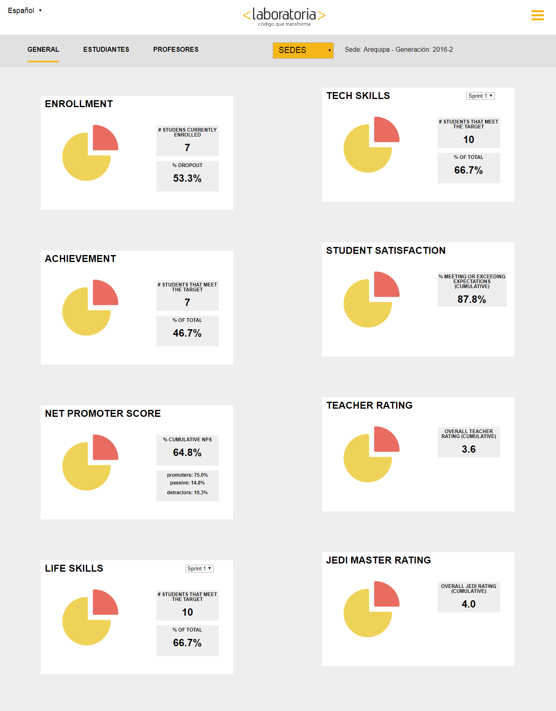

# Data Dashboard

* **Tema:** _Creando tu primer sitio web interactivo_
* **Unidad:** _Producto final_
* **Alumnas:** _Laura Jimenes y Gloria Ramos_

**Herramientas a utilizar:**  
* css
* JavaScript
* html
* Assets
* Data
* Visual Studio Code

**Descripción del trabajo:**
- Nos entregaron una data de Laboratoria, y nos pidieron poder realizar con toda la información dada una intranet donde los profesores, training manager y directores puedan visualiza los datos estadisticos de lo que pasa en cada sede de Laboratoria, y a la vez de todas las promociones hasta el día de hoy.

- Se tuvo que investigar como enlazar data , para que el servidor lo lea y jale los datos correspondientes a cada rubro solicitado.

- Se utilizó las herramientas ya mencionadas para la elaboracion de la pagina solicitada.

** IMAGEN DEL PRODUCTO FINAL**

